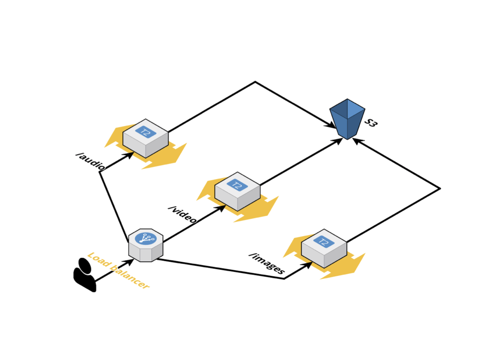

# Assignment 1
Replace the following architecture using Minikube, deploy the servers as K8s deployments



---

# Development
You may need to add a `env` file to `app/` with AWS credentials

```
docker-compose up -d
```

--- 

# Deployment